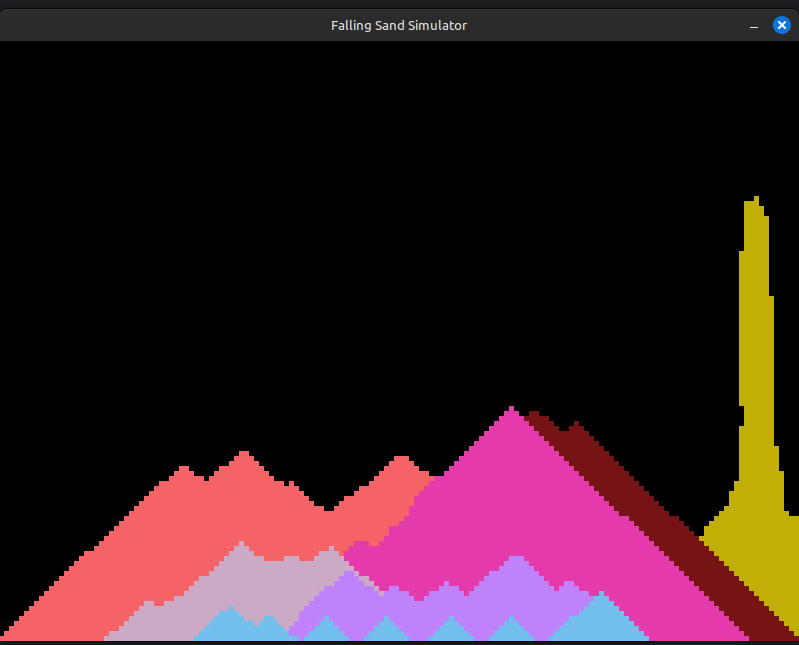

# Falling Sand Game  

This is a **Falling Sand** simulation built using **Python**, **Pygame**, and **Random**. It simulates the behavior of various particles falling and interacting with each other, similar to the classic falling sand games. The game allows users to add particles like sand, water, fire, and more to the simulation.



## Features  
- 💨 **Particle Simulation** with falling sand, water, and fire  
- 🔥 **Particle Interactions** where sand, water, and fire react with each other  
- 🎮 **User Interaction** to place particles and change the environment  
- 🖥️ **Real-time Rendering** with smooth animations and updates  

## Requirements  
Ensure you have the following dependencies installed:  
- Python 3.x  
- `pygame` (for rendering the game and particles)  
- `random` (for generating random events and particle behavior)  

To install `pygame`, run:  
```bash
pip install pygame
